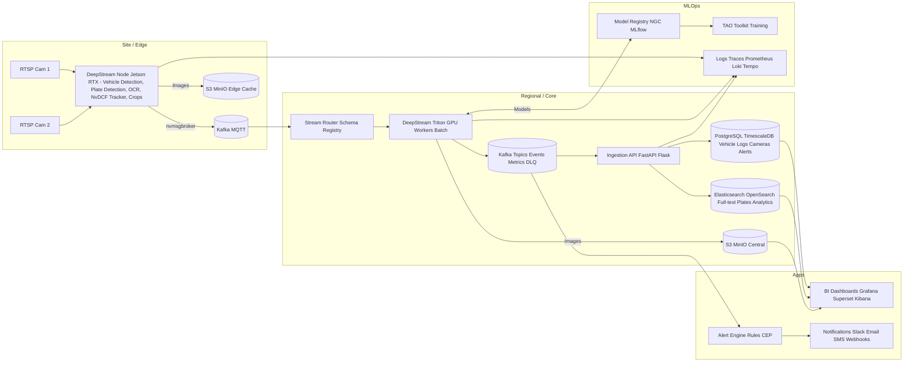

# ALPR System - Next Steps & Roadmap

**Last Updated:** 2025-12-25

This document compares the original system vision with current implementation status and outlines the next modules/services needed to achieve the complete production architecture.

---

## Original Architecture Vision



---

## Implementation Status Matrix

### Edge Layer (Site)

| Component | Original Plan | Current Implementation | Status |
|-----------|---------------|------------------------|--------|
| **RTSP Cameras** | Multi-camera RTSP | CameraIngestionService (cv2.VideoCapture) | ✅ Implemented |
| **Video Decode** | NVDEC (GPU) | NVDEC GPU (RTSP), CPU (video files) | ✅ Implemented |
| **Vehicle Detection** | DeepStream + YOLO | YOLOv11 + TensorRT FP16 | ✅ Implemented |
| **Plate Detection** | DeepStream + YOLO | YOLOv11 + TensorRT FP16 | ✅ Implemented |
| **OCR** | DeepStream probe | PaddleOCR (per-track throttling) | ✅ Implemented |
| **Tracking** | NvDCF (GPU) | ByteTrack (CPU) | ✅ Implemented |
| **Crops** | Automatic cropping | Best-shot selection + cropping | ✅ Implemented |
| **Event Publishing** | nvmsgbroker | kafka-python (KafkaPublisher) | ✅ Implemented |
| **Image Storage** | S3/MinIO (edge cache) | MinIO S3-compatible storage | ✅ Implemented |

**Edge Status:** 🟢 **100% Complete** - Core functionality fully operational with GPU optimization and object storage

---

### Core Layer (Regional)

| Component | Original Plan | Current Implementation | Status |
|-----------|---------------|------------------------|--------|
| **Message Broker** | Kafka + MQTT | Apache Kafka 7.5.0 | ✅ Implemented |
| **Schema Registry** | Confluent Schema Registry | Confluent Schema Registry 7.5.0 + Avro | ✅ Implemented |
| **Stream Router** | Stream processing | None | ❌ Missing |
| **DeepStream Triton** | GPU batch processing | None (edge only) | ❌ Missing |
| **Kafka Topics** | Events, Metrics, DLQ | alpr.plates.detected | 🟡 Partial |
| **Central Storage** | S3/MinIO | MinIO (localhost:9000) | ✅ Implemented |
| **Kafka Consumer** | Event persistence | KafkaStorageConsumer | ✅ Implemented |
| **Database** | PostgreSQL/TimescaleDB | TimescaleDB (PostgreSQL 16) | ✅ Implemented |
| **Full-text Search** | Elasticsearch/OpenSearch | None | ❌ Missing |
| **Query API** | FastAPI | FastAPI Query API | ✅ Implemented |
| **Ingestion API** | FastAPI/Flask | None (using Kafka Consumer) | 🟡 Alternative approach |

**Core Status:** 🟡 **70% Complete** - Schema Registry + storage layer operational, advanced features missing

---

### Apps Layer

| Component | Original Plan | Current Implementation | Status |
|-----------|---------------|------------------------|--------|
| **BI Dashboards** | Grafana/Superset/Kibana | None | ❌ Missing |
| **Data Visualization** | Multi-source dashboards | Manual API queries | ❌ Missing |
| **Alert Engine** | Rules/CEP engine | None | ❌ Missing |
| **Notifications** | Slack/Email/SMS/Webhooks | None | ❌ Missing |

**Apps Status:** 🔴 **0% Complete** - API exists but no user-facing applications

---

### MLOps Layer

| Component | Original Plan | Current Implementation | Status |
|-----------|---------------|------------------------|--------|
| **Model Registry** | NGC/MLflow | Manual model files | ❌ Missing |
| **Model Versioning** | Automated tracking | Git + manual | ❌ Missing |
| **Training Pipeline** | TAO Toolkit | Manual training | ❌ Missing |
| **Metrics/Logs** | Prometheus | Loguru (file logging) | 🟡 Partial |
| **Tracing** | Loki/Tempo | None | ❌ Missing |
| **Monitoring** | Grafana dashboards | Docker logs | ❌ Missing |

**MLOps Status:** 🔴 **10% Complete** - No formal MLOps infrastructure

---

## Overall System Status

| Layer | Completion | Priority |
|-------|-----------|----------|
| **Edge Processing** | 100% | ✅ Production-ready with GPU optimization and object storage |
| **Core Backend** | 70% | 🟡 Schema Registry + storage layer operational |
| **Applications** | 0% | 🔴 Not started |
| **MLOps** | 10% | 🔴 Not started |

**Overall:** 🟢 **45% Complete** - Core ALPR pipeline with Avro serialization and object storage, enterprise features missing

---

## Gap Analysis

### Critical Gaps (Blocking Production Scale)

1. **✅ Object Storage (S3/MinIO)** - COMPLETE
   - **Implemented:** MinIO S3-compatible storage at localhost:9000
   - **Features:** Async image uploads, local cache, presigned URLs
   - **Current:** Images uploaded to MinIO bucket `alpr-plate-images`
   - **Note:** Edge processing fully optimized with GPU decode (4-6 RTSP streams/Jetson)

2. **✅ Schema Registry (Confluent)** - COMPLETE
   - **Implemented:** Confluent Schema Registry 7.5.0 at localhost:8081
   - **Features:** Avro serialization, schema versioning, backward compatibility
   - **Current:** PlateEvent schema (ID: 1) with producer/consumer support
   - **Note:** 62% message size reduction vs JSON, automatic schema validation

3. **Monitoring & Observability** - Priority #1
   - **Missing:** Prometheus, Grafana, distributed tracing
   - **Current:** Docker logs and file logging
   - **Impact:** Difficult to troubleshoot, no performance insights

4. **Alert Engine** - Priority #2
   - **Missing:** Real-time alerting on plate matches
   - **Current:** Manual API queries required
   - **Impact:** No automated notifications for events of interest

### Important Gaps (Production Nice-to-Have)

5. **Elasticsearch/OpenSearch**
   - **Missing:** Full-text search and analytics
   - **Current:** SQL queries via API only
   - **Impact:** Slower searches, limited analytics

6. **BI Dashboards**
   - **Missing:** Pre-built dashboards
   - **Current:** API-only access
   - **Impact:** Manual data analysis required

### Future Enhancements (Scale/Optimization)

7. **DeepStream Migration** - Optional for extreme scale
   - **Current:** Python pipeline with GPU hardware decode (4-6 RTSP streams/Jetson)
   - **DeepStream benefit:** 8-12+ streams per Jetson (2x increase over current)
   - **Note:** GPU video decode now operational, reducing urgency for DeepStream migration

8. **Triton Inference Server**
   - **Missing:** Centralized batch inference
   - **Current:** Edge-only processing
   - **Impact:** Each edge device processes independently

9. **Model Registry (MLflow/NGC)**
   - **Missing:** Version control and experiment tracking
   - **Current:** Manual model management
   - **Impact:** Difficult to track model performance

10. **TAO Toolkit Training**
    - **Missing:** Automated retraining pipeline
    - **Current:** Manual training
    - **Impact:** Slow iteration on model improvements

---

## Prioritized Roadmap

### Phase 3: Production Essentials (Next 1-2 Months)

**✅ Priority 1: Object Storage (S3/MinIO)** - COMPLETE
- **Status:** ✅ Implemented and operational
- **Components:**
  - ✅ MinIO server (Docker) running at localhost:9000
  - ✅ Async image upload service in pilot.py
  - ✅ S3 URL storage in database
  - ✅ ThreadPoolExecutor for background uploads
- **Value:** High - enables image retention and external access

**Priority 1: Monitoring Stack**
- **Goal:** Observability for all services
- **Components:**
  - Prometheus (metrics collection)
  - Grafana (dashboards)
  - Loki (log aggregation)
  - cAdvisor (container metrics)
- **Effort:** 1 week
- **Value:** High - critical for production

**Priority 2: Alert Engine**
- **Goal:** Real-time notifications on events
- **Components:**
  - Alert rules engine (Python service)
  - Kafka consumer for events
  - Notification adapters (Email, Slack, Webhooks)
  - Alert configuration (YAML)
- **Effort:** 2 weeks
- **Value:** High - enables automation

**Priority 3: Basic Dashboards**
- **Goal:** User-facing data visualization
- **Components:**
  - Grafana dashboards (events, stats, cameras)
  - TimescaleDB datasource
  - Image viewer integration
- **Effort:** 1 week
- **Value:** Medium - improves usability

---

### Phase 4: Enterprise Features (2-4 Months)

**✅ Priority 4: Schema Registry** - COMPLETE
- **Status:** ✅ Implemented and operational
- **Components:**
  - ✅ Confluent Schema Registry 7.5.0 (Docker)
  - ✅ PlateEvent Avro schema registered (ID: 1)
  - ✅ AvroKafkaPublisher in pilot.py
  - ✅ AvroKafkaConsumer with auto-deserialization
- **Value:** High - 62% message size reduction, schema validation

**Priority 5: Elasticsearch Integration**
- **Goal:** Full-text search and analytics
- **Components:**
  - Elasticsearch/OpenSearch cluster
  - Kafka consumer → Elasticsearch
  - Search API endpoints
  - Analytics dashboards
- **Effort:** 2 weeks
- **Value:** Medium - better search and analytics

**Priority 6: Multi-Topic Kafka**
- **Goal:** Separate event types
- **Components:**
  - Topics: events, metrics, alerts, DLQ
  - Stream routing logic
  - Dead letter queue handling
- **Effort:** 1 week
- **Value:** Medium - better organization

**Priority 7: Advanced BI**
- **Goal:** Comprehensive analytics
- **Components:**
  - Apache Superset or Metabase
  - Pre-built dashboards
  - Report generation
- **Effort:** 2 weeks
- **Value:** Medium - better insights

---

### Phase 5: Scale & Optimization (4-6 Months)

**Priority 8: DeepStream Migration**
- **Goal:** 6-8x throughput increase
- **Components:**
  - DeepStream application (C++/Python)
  - TensorRT engines for YOLO
  - NvDCF tracker configuration
  - nvmsgbroker integration
- **Effort:** 4-6 weeks
- **Value:** High (for scale) - enables 8-12 streams per Jetson

**Priority 9: Triton Inference Server**
- **Goal:** Centralized batch inference
- **Components:**
  - Triton server deployment
  - Model repository
  - Client integration from edge
- **Effort:** 2-3 weeks
- **Value:** Medium - optional optimization

---

### Phase 6: MLOps (6+ Months)

**Priority 10: Model Registry**
- **Goal:** Track model versions and experiments
- **Components:**
  - MLflow server
  - Model versioning
  - Experiment tracking
  - Model deployment automation
- **Effort:** 2 weeks
- **Value:** Medium - improves ML workflow

**Priority 11: Training Pipeline**
- **Goal:** Automated model retraining
- **Components:**
  - TAO Toolkit integration
  - Training data pipeline
  - Automated evaluation
  - Model promotion workflow
- **Effort:** 4-6 weeks
- **Value:** Medium - enables continuous improvement

**Priority 12: Advanced Observability**
- **Goal:** Full distributed tracing
- **Components:**
  - Tempo (tracing backend)
  - OpenTelemetry instrumentation
  - Service mesh (optional)
- **Effort:** 2-3 weeks
- **Value:** Low - nice to have

---

## Detailed Implementation Plans

### 1. ✅ Object Storage (MinIO/S3) - COMPLETE

**Implementation Status:**
- ✅ MinIO server deployed via Docker Compose (localhost:9000)
- ✅ Bucket created: `alpr-plate-images`
- ✅ `ImageStorageService` class implemented with async uploads
- ✅ `pilot.py` uploads crops asynchronously after saving to disk
- ✅ ThreadPoolExecutor with 4 upload threads
- ✅ S3 URLs stored in database `plate_image_url` field
- ✅ MinIO console accessible at localhost:9001

**Key Features:**
- Async background uploads (non-blocking)
- Local cache with automatic cleanup
- Metadata tagging (camera_id, track_id, plate_text)
- Upload retry logic with exponential backoff
- Health monitoring and statistics

**Files Modified:**
- `docker-compose.yml` - Added MinIO services
- `services/storage/image_storage_service.py` - New upload service
- `pilot.py` - Integrated async uploads in `_save_best_crop_to_disk()`
- `services/storage/requirements.txt` - Added minio dependency

**Next Steps:**
- Optional: Add presigned URL generation in Query API
- Optional: Implement lifecycle policies for old images

---

### 2. Monitoring Stack (Prometheus + Grafana)

**Architecture:**
```
Services (pilot.py, kafka-consumer, query-api)
  └─> Expose /metrics endpoint (prometheus_client)

Prometheus
  ├─> Scrape all services
  ├─> Scrape cAdvisor (container metrics)
  └─> Store time-series data

Grafana
  ├─> Prometheus datasource
  ├─> TimescaleDB datasource
  └─> Pre-built dashboards
```

**Implementation Steps:**
1. Add `prometheus_client` to all Python services
2. Expose metrics endpoints:
   - pilot.py: FPS, detection count, OCR latency
   - kafka-consumer: messages consumed, insert rate
   - query-api: request count, response time
3. Deploy Prometheus via Docker Compose
4. Deploy cAdvisor for container metrics
5. Deploy Grafana via Docker Compose
6. Create dashboards:
   - System Overview (CPU, RAM, GPU)
   - ALPR Pipeline (FPS, events, latency)
   - Database Performance (query time, rows)
   - Kafka Metrics (lag, throughput)

**Configuration:**
```yaml
# prometheus.yml
scrape_configs:
  - job_name: 'pilot'
    static_configs:
      - targets: ['host.docker.internal:8001']

  - job_name: 'kafka-consumer'
    static_configs:
      - targets: ['kafka-consumer:8002']

  - job_name: 'query-api'
    static_configs:
      - targets: ['query-api:8000']

  - job_name: 'cadvisor'
    static_configs:
      - targets: ['cadvisor:8080']
```

**Estimated Effort:** 1 week

---

### 3. Alert Engine (Priority 2)

**Architecture:**
```
Kafka Topic: alpr.plates.detected
  └─> Alert Consumer (Python service)
       ├─> Evaluate rules (YAML config)
       ├─> Match patterns (plate lists, zones, time windows)
       └─> Trigger notifications

Alert Rules (alert_rules.yaml)
  ├─> Watchlist plates
  ├─> Zone violations
  ├─> Confidence thresholds
  └─> Rate limits

Notification Channels
  ├─> Email (SMTP)
  ├─> Slack (webhooks)
  ├─> SMS (Twilio)
  └─> Webhooks (custom)
```

**Implementation Steps:**
1. Create `AlertEngineService` class
2. Define alert rule schema (YAML)
3. Implement rule evaluation logic
4. Create notification adapters:
   - EmailNotifier (SMTP)
   - SlackNotifier (webhooks)
   - SMSNotifier (Twilio)
   - WebhookNotifier (generic)
5. Deploy as Docker service
6. Add admin API for rule management
7. Test with sample alerts

**Alert Rules Example:**
```yaml
# config/alert_rules.yaml
rules:
  - name: "Watchlist Match"
    type: plate_match
    plates:
      - "ABC1234"
      - "XYZ9876"
    actions:
      - type: email
        to: "security@example.com"
      - type: slack
        channel: "#alerts"

  - name: "High Confidence Detection"
    type: threshold
    field: plate_confidence
    operator: ">="
    value: 0.95
    actions:
      - type: webhook
        url: "https://api.example.com/events"
```

**Estimated Effort:** 2 weeks

---

### 4. Elasticsearch Integration (Priority 4)

**Architecture:**
```
Kafka Topic: alpr.plates.detected
  └─> Elasticsearch Consumer (Python service)
       └─> Index events to Elasticsearch

Elasticsearch Cluster
  ├─> Index: alpr-events-*
  ├─> Full-text search on plate text
  └─> Aggregations for analytics

Query API
  ├─> Add /search/fulltext endpoint
  └─> Add /analytics/* endpoints
```

**Implementation Steps:**
1. Deploy Elasticsearch via Docker Compose
2. Create index templates with mappings
3. Create `ElasticsearchConsumer` service
4. Consume from Kafka → index to ES
5. Add search endpoints to Query API
6. Create Kibana dashboards (optional)
7. Test search and analytics

**Index Mapping:**
```json
{
  "mappings": {
    "properties": {
      "event_id": { "type": "keyword" },
      "captured_at": { "type": "date" },
      "plate_text": { "type": "text", "analyzer": "standard" },
      "plate_normalized_text": { "type": "keyword" },
      "camera_id": { "type": "keyword" },
      "vehicle_type": { "type": "keyword" },
      "location": { "type": "geo_point" }
    }
  }
}
```

**Estimated Effort:** 2 weeks

---

### 5. DeepStream Migration (Priority 8 - Future)

**Architecture:**
```
DeepStream Application (C++/Python)
  ├─> uridecodebin (RTSP input)
  ├─> NVDEC (GPU decode)
  ├─> nvstreammux (batch frames)
  ├─> nvinfer (YOLOv11 TensorRT)
  ├─> nvtracker (NvDCF)
  ├─> Python probe (OCR + event processing)
  ├─> nvmsgconv (JSON conversion)
  └─> nvmsgbroker (Kafka publish)

Backend Services
  └─> No changes needed!
```

**Implementation Steps:**
1. Export YOLOv11 to TensorRT (.engine)
2. Create DeepStream config files
3. Write Python probe for OCR
4. Implement event processing in probe
5. Configure nvmsgbroker for Kafka
6. Test multi-stream performance
7. Deploy alongside pilot.py (gradual migration)

**Estimated Effort:** 4-6 weeks

---

## Quick Wins (1-2 Weeks)

For immediate value, prioritize these quick wins:

1. **✅ MinIO Deployment** - COMPLETE
   - ✅ Deployed MinIO via Docker
   - ✅ Created bucket: alpr-plate-images
   - ✅ Tested async uploads from pilot.py

2. **Basic Grafana Dashboard** (2 days)
   - Deploy Grafana
   - Connect to TimescaleDB
   - Create events dashboard

3. **Simple Email Alerts** (3 days)
   - Create basic alert script
   - Monitor Kafka for watchlist plates
   - Send email via SMTP

4. **Prometheus Metrics** (2 days)
   - Add metrics to pilot.py
   - Deploy Prometheus
   - Create basic dashboard

**Total Quick Wins Effort:** 10 days
**Value:** High - immediate production improvements

---

## Resource Requirements

### Infrastructure

| Component | CPU | RAM | Storage | Notes |
|-----------|-----|-----|---------|-------|
| MinIO | 2 cores | 2GB | 500GB+ | Scales with image volume |
| Elasticsearch | 4 cores | 8GB | 100GB+ | Heap size = 4GB |
| Prometheus | 2 cores | 4GB | 50GB | Retention = 30 days |
| Grafana | 1 core | 1GB | 10GB | Dashboards + plugins |
| Alert Engine | 1 core | 512MB | 1GB | Lightweight service |
| **Total Added** | **10 cores** | **15.5GB** | **660GB+** | On top of existing backend |

### Current Backend vs Full Stack

| Configuration | CPU | RAM | Storage |
|---------------|-----|-----|---------|
| Current (Phase 2) | 8 cores | 4GB | 50GB |
| Full (Phase 4) | 18 cores | 19.5GB | 710GB |

**Recommendation:** Run on dedicated server or upgrade Jetson backend allocation

---

## Technology Decisions

### Object Storage: MinIO vs AWS S3

| Factor | MinIO | AWS S3 |
|--------|-------|--------|
| Cost | Free (self-hosted) | Pay per GB/request |
| Performance | Local LAN speeds | Internet latency |
| Scalability | Limited by server | Unlimited |
| Setup | Easy (Docker) | Account setup |
| **Recommendation** | ✅ MinIO for edge/core | S3 for cloud hybrid |

### Search: Elasticsearch vs OpenSearch

| Factor | Elasticsearch | OpenSearch |
|--------|---------------|------------|
| License | SSPL (restrictive) | Apache 2.0 |
| Features | More plugins | Compatible fork |
| Support | Elastic.co | AWS/community |
| **Recommendation** | ✅ OpenSearch (open license) | Elasticsearch if already using |

### BI: Grafana vs Superset vs Metabase

| Factor | Grafana | Superset | Metabase |
|--------|---------|----------|----------|
| Time-series | Excellent | Good | Fair |
| SQL queries | Good | Excellent | Excellent |
| Setup | Easy | Moderate | Easy |
| **Recommendation** | ✅ Grafana (already planned) | Superset for advanced analytics | Metabase for simplicity |

---

## Migration Path from Current System

### Step 1: Add Object Storage (Week 1-2)
- Deploy MinIO
- Update pilot.py to upload images
- Update Query API to serve presigned URLs
- **No breaking changes**

### Step 2: Add Monitoring (Week 3)
- Deploy Prometheus + Grafana
- Add metrics to services
- Create dashboards
- **No breaking changes**

### Step 3: Add Alerting (Week 4-5)
- Deploy Alert Engine
- Configure rules
- Set up notifications
- **No breaking changes**

### Step 4: Add Search (Week 6-7)
- Deploy Elasticsearch
- Create consumer
- Add search endpoints
- **Optional new feature**

### Step 5: Optimize Edge (Week 8+)
- Migrate to DeepStream (optional)
- **Gradual rollout**

**Zero Downtime:** All additions are non-breaking and can run alongside existing services

---

## Success Metrics

### Phase 3 Targets (Production Essentials)

| Metric | Current | Target | How to Measure |
|--------|---------|--------|----------------|
| Image retention | 7 days (local disk) | 90 days | MinIO storage |
| MTTR (Mean Time to Repair) | Unknown | <15 min | Grafana alerts |
| Alert latency | N/A | <5 sec | Alert Engine logs |
| Search latency | 100ms (SQL) | <50ms | Elasticsearch |
| Dashboard users | 0 | 5+ | Grafana analytics |

### Phase 4 Targets (Enterprise)

| Metric | Current | Target | How to Measure |
|--------|---------|--------|----------------|
| Uptime | Unknown | 99.5% | Prometheus uptime |
| Search recall | N/A | >95% | Elasticsearch metrics |
| Alert accuracy | N/A | >90% | False positive rate |
| User satisfaction | N/A | 8/10 | Survey |

---

## Conclusion

**Current Status:** Production-ready core pipeline (43% of original vision)

**Completed (Phase 3 - Part 1):**
- ✅ Object Storage (MinIO) with async uploads

**Next Priority:** Production Essentials (Phase 3 - Part 2)
- Monitoring (Prometheus/Grafana)
- Alerting (Alert Engine)
- Basic Dashboards

**Timeline:** 3-4 weeks for Phase 3 completion

**Value:** Transforms from "working system" to "production system with full ops"

**ROI:** High - enables full deployment, monitoring, and alerting

---

## Quick Reference

### What's Working Now
✅ Edge processing (pilot.py)
✅ Kafka messaging
✅ TimescaleDB storage
✅ REST API queries
✅ Docker deployment
✅ MinIO object storage (async image uploads)

### What's Missing (Critical)
❌ Monitoring/observability
❌ Alerting/notifications
❌ User dashboards

### What's Missing (Nice-to-Have)
❌ Full-text search
❌ Schema registry
❌ BI analytics
❌ Model registry
❌ Training pipeline

### What's Optional (Future)
⏭️ DeepStream migration (6-8x throughput)
⏭️ Triton Inference Server
⏭️ Advanced MLOps

**The system works today. Phase 3 makes it production-grade. Phase 4+ makes it enterprise-grade.**
