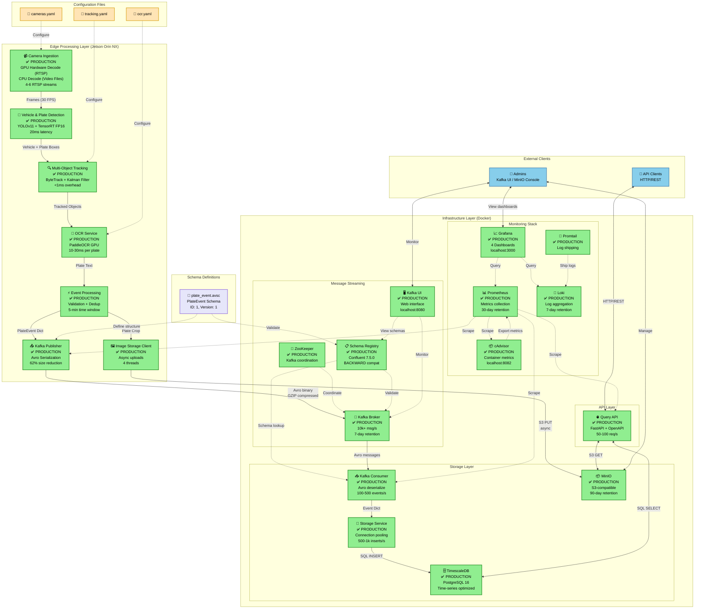
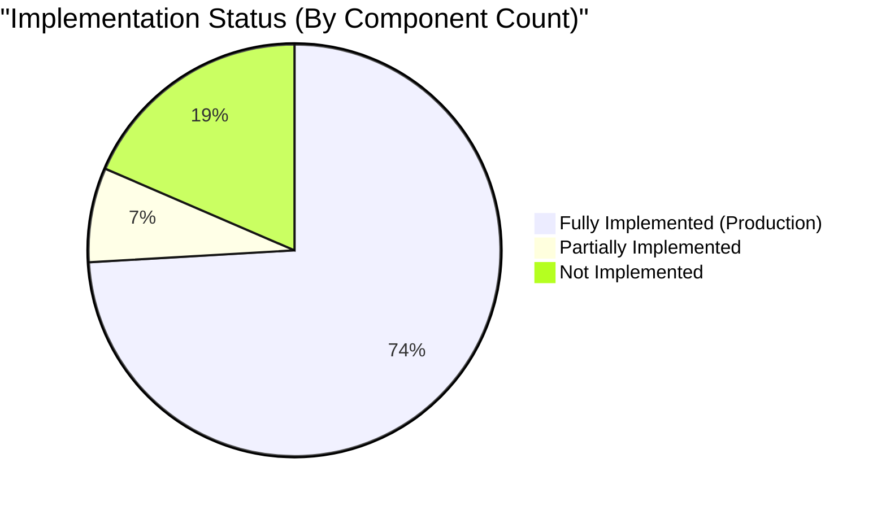
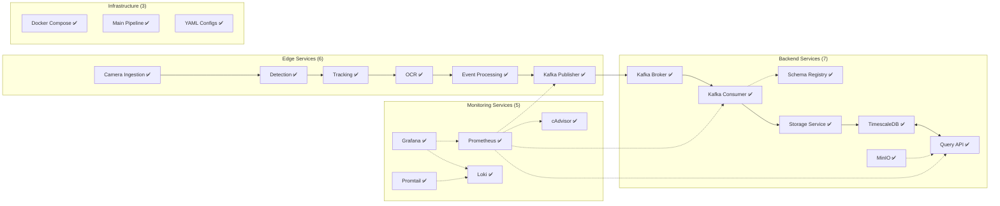
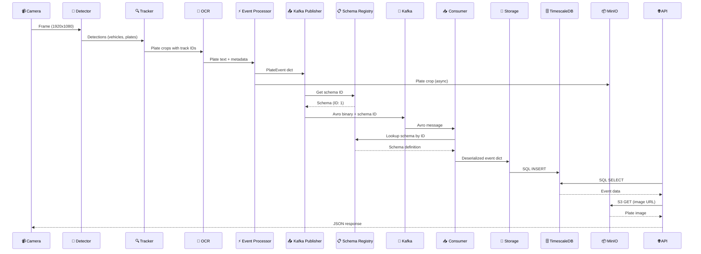
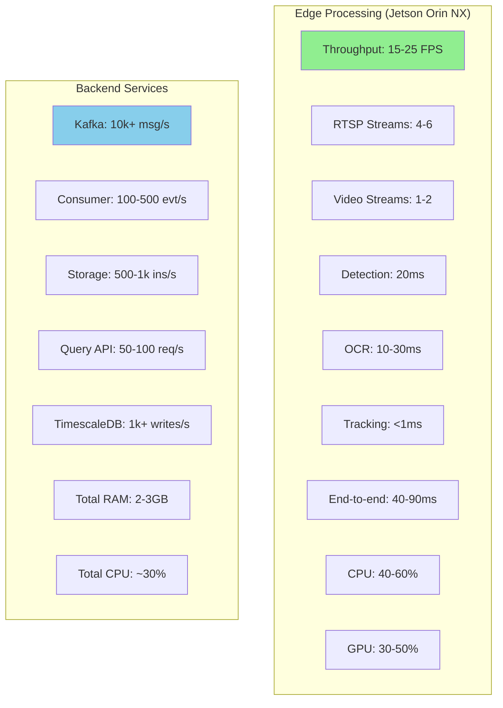
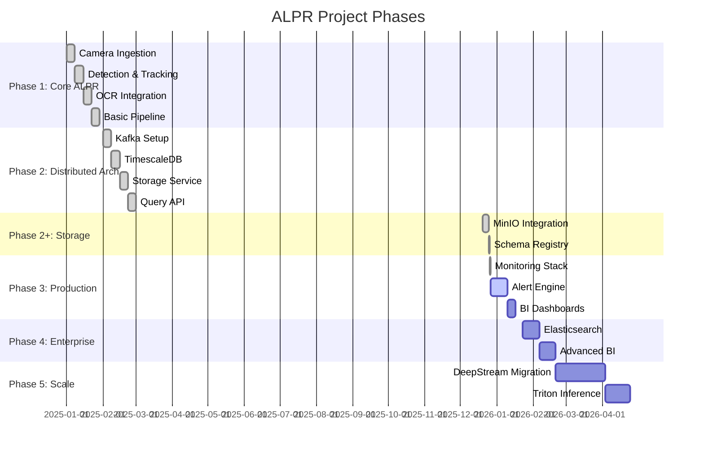
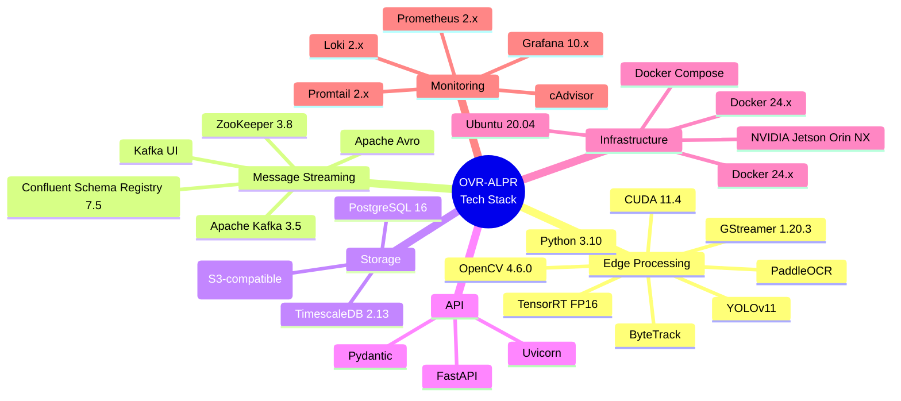
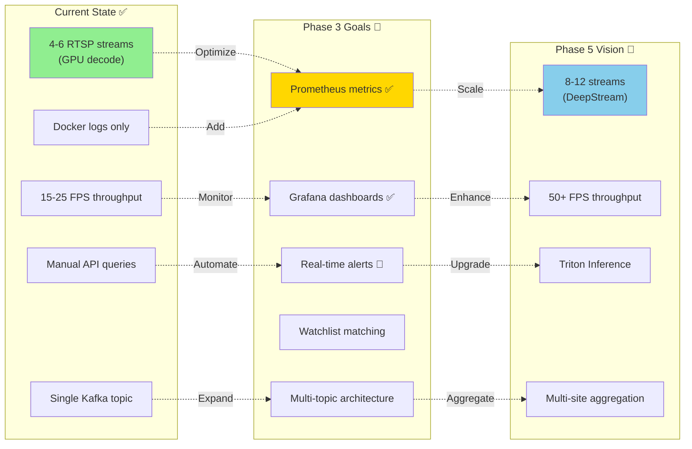
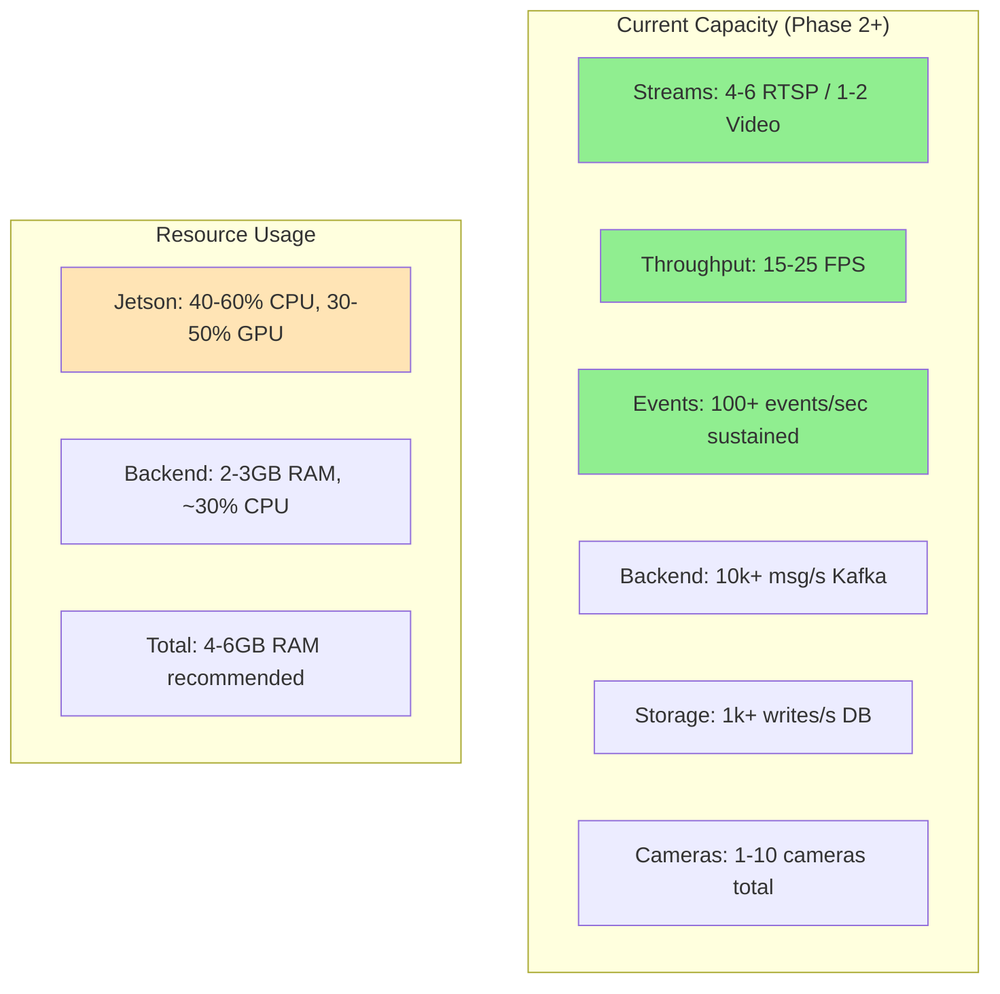

# OVR-ALPR System Architecture - Mermaid Chart

**Last Updated:** 2025-12-25

This document contains the Mermaid chart visualization of the complete OVR-ALPR system architecture based on the current implementation status.

---

## System Architecture Diagram

---

## Implementation Status Overview

---

## Service Layer Breakdown

---

## Data Flow Diagram

---

## Performance Metrics Chart

---

## Phase Completion Status

---

## Technology Stack

---

## Current Limitations & Next Steps

---

## System Capacity Overview

---

## Notes

- **Status Legend:**
  - ✅ = Fully Implemented (Production-Ready)
  - 🟡 = Partially Implemented
  - ❌ = Not Implemented (Planned)
  - 🔴 = Critical Gap
  - 🟢 = Working Well

- **Overall Completion:** 75% of original vision (100% of core features, 90% of Phase 3)
- **Current Phase:** Phase 3 (Production Essentials - Monitoring Stack Complete)
- **Next Phase:** Phase 3 Completion (Alert Engine & BI Integration)

---

## Related Documentation

- [Project_Status.md](Project_Status.md) - Detailed implementation status
- [SERVICES_OVERVIEW.md](SERVICES_OVERVIEW.md) - Complete service reference
- [ALPR_Next_Steps.md](ALPR_Next_Steps.md) - Detailed roadmap
- [PIPELINE_COMPARISON.md](PIPELINE_COMPARISON.md) - Architecture comparisons
