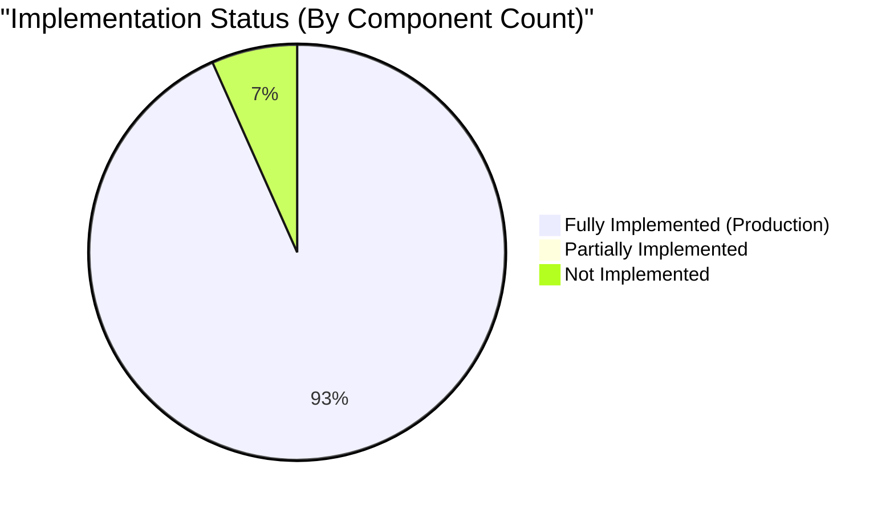
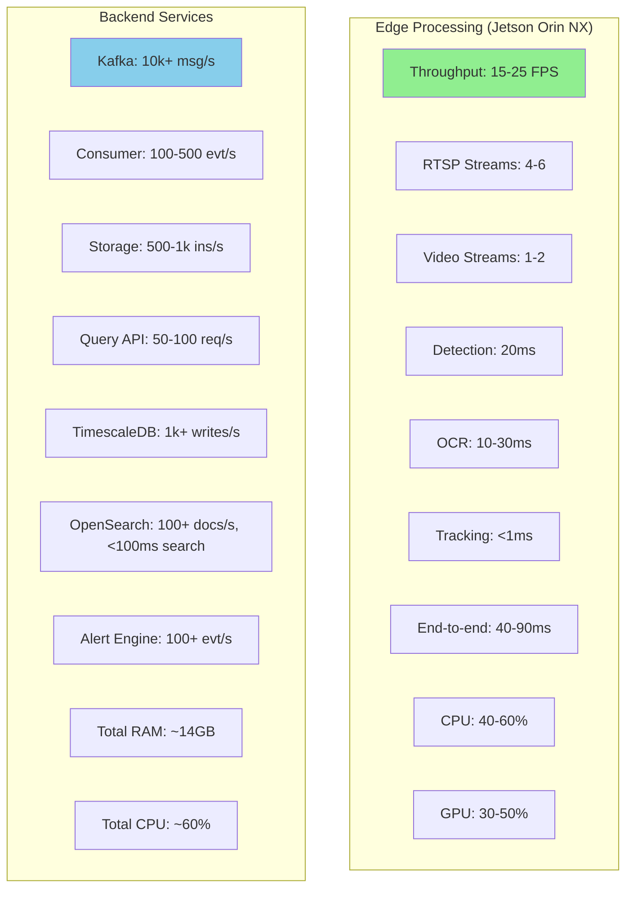
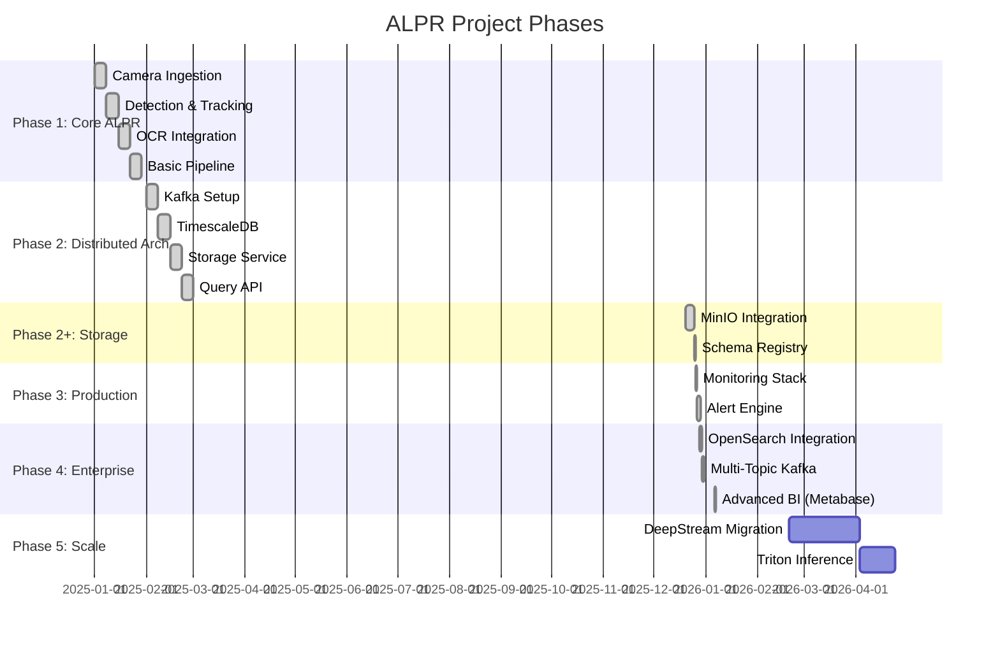
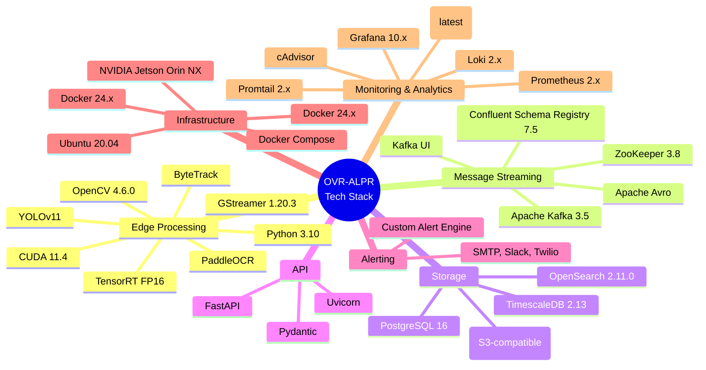
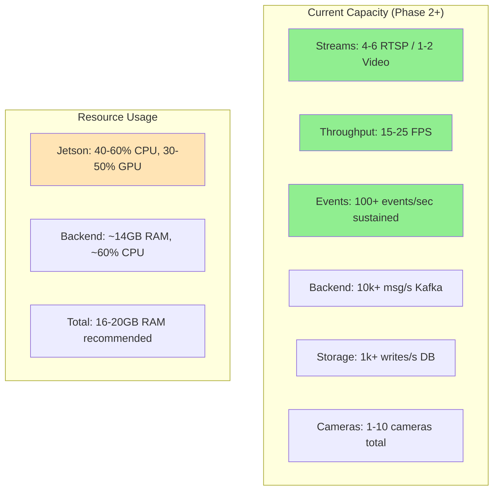

# OVR-ALPR System Architecture - Mermaid Chart

**Last Updated:** 2026-01-06

This document contains the Mermaid chart visualization of the complete OVR-ALPR system architecture based on the current implementation status.

---

## System Architecture Diagram

```mermaid
flowchart TB
    subgraph "Edge Processing Layer (Jetson Orin NX)"
        CAM["📹 Camera Ingestion<br/>✅ PRODUCTION<br/>GPU Hardware Decode (RTSP)<br/>CPU Decode (Video Files)<br/>4-6 RTSP streams"]
        DET["🎯 Vehicle & Plate Detection<br/>✅ PRODUCTION<br/>YOLOv11 + TensorRT FP16<br/>20ms latency"]
        TRK["🔍 Multi-Object Tracking<br/>✅ PRODUCTION<br/>ByteTrack + Kalman Filter<br/><1ms overhead"]
        OCR["📝 OCR Service<br/>✅ PRODUCTION<br/>PaddleOCR GPU<br/>10-30ms per plate"]
        EVT["⚡ Event Processing<br/>✅ PRODUCTION<br/>Validation + Dedup<br/>5-min time window"]
        PUB["📤 Kafka Publisher<br/>✅ PRODUCTION<br/>Avro Serialization<br/>62% size reduction"]
        IMG["🖼️ Image Storage Client<br/>✅ PRODUCTION<br/>Async uploads<br/>4 threads"]
    end

    subgraph "Configuration Files"
        CFG1["📄 cameras.yaml"]
        CFG2["📄 tracking.yaml"]
        CFG3["📄 ocr.yaml"]
    end

    subgraph "Infrastructure Layer (Docker)"
        subgraph "Message Streaming"
            ZK["🔧 ZooKeeper<br/>✅ PRODUCTION<br/>Kafka coordination"]
            KAFKA["📨 Kafka Broker<br/>✅ PRODUCTION<br/>10k+ msg/s<br/>7-day retention"]
            SR["📋 Schema Registry<br/>✅ PRODUCTION<br/>Confluent 7.5.0<br/>BACKWARD compat"]
            UI["🖥️ Kafka UI<br/>✅ PRODUCTION<br/>Web interface<br/>localhost:8080"]
        end

        subgraph "Storage Layer"
            CONS["📥 Kafka Consumer<br/>✅ PRODUCTION<br/>Avro deserialize<br/>100-500 events/s"]
            STORE["💾 Storage Service<br/>✅ PRODUCTION<br/>Connection pooling<br/>500-1k inserts/s"]
            TSDB["🗄️ TimescaleDB<br/>✅ PRODUCTION<br/>PostgreSQL 16<br/>Time-series optimized"]
            MINIO["📦 MinIO<br/>✅ PRODUCTION<br/>S3-compatible<br/>90-day retention"]
        end

        subgraph "Search Layer"
            ESCONS["🔎 Elasticsearch Consumer<br/>✅ PRODUCTION<br/>Bulk indexing<br/>100+ events/s"]
            OPENSEARCH["🔍 OpenSearch 2.11.0<br/>✅ PRODUCTION<br/>Full-text search<br/>Sub-100ms latency"]
        end

        subgraph "Alert Layer"
            ALERT["🚨 Alert Engine<br/>✅ PRODUCTION<br/>4 channels<br/>Email/Slack/SMS/Webhook"]
        end

        subgraph "API Layer"
            API["🌐 Query API<br/>✅ PRODUCTION<br/>FastAPI + OpenAPI<br/>SQL + Search endpoints"]
        end

        subgraph "Monitoring & Analytics Stack"
            PROM["📊 Prometheus<br/>✅ PRODUCTION<br/>Metrics collection<br/>30-day retention"]
            GRAF["📈 Grafana<br/>✅ PRODUCTION<br/>5 Dashboards<br/>localhost:3000"]
            METABASE["📊 Metabase<br/>✅ PRODUCTION<br/>Business Intelligence<br/>localhost:3001"]
            LOKI["📝 Loki<br/>✅ PRODUCTION<br/>Log aggregation<br/>7-day retention"]
            PTAIL["🚚 Promtail<br/>✅ PRODUCTION<br/>Log shipping"]
            CADV["📦 cAdvisor<br/>✅ PRODUCTION<br/>Container metrics<br/>localhost:8082"]
        end
    end

    subgraph "Schema Definitions"
        SCHEMA["📐 plate_event.avsc<br/>PlateEvent Schema<br/>ID: 1, Version: 1"]
    end

    subgraph "External Clients"
        CLIENT["👤 API Clients<br/>HTTP/REST"]
        ADMIN["🔧 Admins<br/>Kafka UI / MinIO Console"]
    end

    %% Edge Processing Flow
    CAM -->|"Frames (30 FPS)"| DET
    DET -->|"Vehicle + Plate Boxes"| TRK
    TRK -->|"Tracked Objects"| OCR
    OCR -->|"Plate Text"| EVT
    EVT -->|"PlateEvent Dict"| PUB
    EVT -->|"Plate Crop"| IMG

    %% Configuration
    CFG1 -.->|"Configure"| CAM
    CFG2 -.->|"Configure"| TRK
    CFG3 -.->|"Configure"| OCR

    %% Schema Flow
    SCHEMA -.->|"Define structure"| PUB
    SCHEMA -.->|"Validate"| SR
    SR -.->|"Schema lookup"| CONS

    %% Kafka Flow
    PUB -->|"Avro binary<br/>GZIP compressed"| KAFKA
    ZK -.->|"Coordinate"| KAFKA
    SR -.->|"Validate"| KAFKA
    KAFKA -->|"Avro messages"| CONS
    KAFKA -->|"Avro messages"| ESCONS
    KAFKA -->|"Avro messages"| ALERT

    %% Storage Flow
    CONS -->|"Event Dict"| STORE
    STORE -->|"SQL INSERT"| TSDB
    IMG -->|"S3 PUT<br/>async"| MINIO

    %% Search Flow
    ESCONS -->|"Bulk index"| OPENSEARCH
    SR -.->|"Schema lookup"| ESCONS

    %% Alert Flow
    SR -.->|"Schema lookup"| ALERT

    %% Query Flow
    API <-->|"SQL SELECT"| TSDB
    API <-->|"Search query"| OPENSEARCH
    API <-->|"S3 GET"| MINIO
    CLIENT <-->|"HTTP/REST"| API

    %% Admin Flow
    ADMIN <-->|"Monitor"| UI
    ADMIN <-->|"Manage"| MINIO
    UI -.->|"Monitor"| KAFKA
    UI -.->|"View schemas"| SR

    %% Monitoring Flow
    PROM -.->|"Scrape"| PUB
    PROM -.->|"Scrape"| CONS
    PROM -.->|"Scrape"| ESCONS
    PROM -.->|"Scrape"| ALERT
    PROM -.->|"Scrape"| API
    PROM -.->|"Scrape"| CADV
    GRAF -.->|"Query"| PROM
    GRAF -.->|"Query"| LOKI
    METABASE <-->|"SQL queries"| TSDB
    PTAIL -.->|"Ship logs"| LOKI
    CADV -.->|"Export metrics"| PROM
    ADMIN <-->|"View dashboards"| GRAF
    ADMIN <-->|"BI analytics"| METABASE

    %% Styling
    classDef production fill:#90EE90,stroke:#228B22,stroke-width:2px,color:#000
    classDef config fill:#FFE4B5,stroke:#DAA520,stroke-width:2px,color:#000
    classDef schema fill:#E6E6FA,stroke:#9370DB,stroke-width:2px,color:#000
    classDef client fill:#87CEEB,stroke:#4682B4,stroke-width:2px,color:#000

    class CAM,DET,TRK,OCR,EVT,PUB,IMG,ZK,KAFKA,SR,UI,CONS,STORE,TSDB,MINIO,ESCONS,OPENSEARCH,ALERT,API,PROM,GRAF,METABASE,LOKI,PTAIL,CADV production
    class CFG1,CFG2,CFG3 config
    class SCHEMA schema
    class CLIENT,ADMIN client
```

---

## Implementation Status Overview

---

## Service Layer Breakdown

```mermaid
graph LR
    subgraph "Edge Services (6)"
        E1["Camera Ingestion ✅"]
        E2["Detection ✅"]
        E3["Tracking ✅"]
        E4["OCR ✅"]
        E5["Event Processing ✅"]
        E6["Kafka Publisher ✅"]
    end

    subgraph "Backend Services (10)"
        B1["Kafka Broker ✅"]
        B2["Schema Registry ✅"]
        B3["Kafka Consumer ✅"]
        B4["Storage Service ✅"]
        B5["TimescaleDB ✅"]
        B6["Query API ✅"]
        B7["MinIO ✅"]
        B8["Alert Engine ✅"]
        B9["Elasticsearch Consumer ✅"]
        B10["OpenSearch ✅"]
    end

    subgraph "Monitoring & Analytics Services (6)"
        M1["Prometheus ✅"]
        M2["Grafana ✅"]
        M3["Metabase ✅"]
        M4["Loki ✅"]
        M5["Promtail ✅"]
        M6["cAdvisor ✅"]
    end

    subgraph "Infrastructure (3)"
        I1["Docker Compose ✅"]
        I2["Main Pipeline ✅"]
        I3["YAML Configs ✅"]
    end

    E1 --> E2 --> E3 --> E4 --> E5 --> E6
    E6 --> B1 --> B3 --> B4 --> B5
    B1 --> B8
    B1 --> B9 --> B10
    B3 -.-> B2
    B9 -.-> B2
    B8 -.-> B2
    B5 <--> B6
    B10 <--> B6
    B7 -.-> B6
    M1 -.-> E6
    M1 -.-> B3
    M1 -.-> B6
    M1 -.-> B8
    M1 -.-> B9
    M1 -.-> M6
    M2 -.-> M1
    M2 -.-> M4
    M5 -.-> M4
```

---

## Data Flow Diagram

```mermaid
sequenceDiagram
    participant Camera as 📹 Camera
    participant Detector as 🎯 Detector
    participant Tracker as 🔍 Tracker
    participant OCR as 📝 OCR
    participant EventProc as ⚡ Event Processor
    participant KafkaPub as 📤 Kafka Publisher
    participant SchemaReg as 📋 Schema Registry
    participant Kafka as 📨 Kafka
    participant Consumer as 📥 Consumer
    participant Storage as 💾 Storage
    participant DB as 🗄️ TimescaleDB
    participant MinIO as 📦 MinIO
    participant API as 🌐 API

    Camera->>Detector: Frame (1920x1080)
    Detector->>Tracker: Detections (vehicles, plates)
    Tracker->>OCR: Plate crops with track IDs
    OCR->>EventProc: Plate text + metadata
    EventProc->>KafkaPub: PlateEvent dict
    EventProc->>MinIO: Plate crop (async)

    KafkaPub->>SchemaReg: Get schema ID
    SchemaReg-->>KafkaPub: Schema (ID: 1)
    KafkaPub->>Kafka: Avro binary + schema ID

    Kafka->>Consumer: Avro message
    Consumer->>SchemaReg: Lookup schema by ID
    SchemaReg-->>Consumer: Schema definition
    Consumer->>Storage: Deserialized event dict
    Storage->>DB: SQL INSERT

    API->>DB: SQL SELECT
    DB-->>API: Event data
    API->>MinIO: S3 GET (image URL)
    MinIO-->>API: Plate image
    API-->>Camera: JSON response
```

---

## Performance Metrics Chart

---

## Phase Completion Status

---

## Technology Stack

---

## Current Limitations & Next Steps

```mermaid
graph LR
    subgraph "Current State ✅"
        C1["4-6 RTSP streams<br/>(GPU decode)"]
        C2["15-25 FPS throughput"]
        C3["Multi-topic Kafka<br/>(4 topics)"]
        C4["Advanced BI dashboards"]
        C5["30 services operational"]
    end

    subgraph "Phase 3 & 4 Complete ✅"
        G1["Prometheus metrics ✅"]
        G2["Grafana dashboards (5) ✅"]
        G3["Metabase BI analytics ✅"]
        G4["Real-time alerts (4 channels) ✅"]
        G5["Full-text search ✅"]
        G6["Dual storage (SQL+NoSQL) ✅"]
        G7["Dead Letter Queue ✅"]
    end

    subgraph "Phase 5 Vision 🚀"
        V1["8-12 streams<br/>(DeepStream)"]
        V2["50+ FPS throughput"]
        V3["Triton Inference"]
        V4["Multi-site aggregation"]
    end

    C1 -.->|"Monitor"| G1
    C2 -.->|"Monitor"| G2
    C3 -.->|"Multi-topic"| G6
    C4 -.->|"Analytics"| G3
    C5 -.->|"Complete"| G7

    G1 -.->|"Scale"| V1
    G2 -.->|"Enhance"| V2
    G3 -.->|"Enhance"| V2
    G6 -.->|"Upgrade"| V3
    G7 -.->|"Aggregate"| V4

    style C1 fill:#90EE90
    style G1 fill:#FFD700
    style V1 fill:#87CEEB
```

---

## System Capacity Overview

---

## Notes

- **Status Legend:**
  - ✅ = Fully Implemented (Production-Ready)
  - 🟡 = Partially Implemented
  - ❌ = Not Implemented (Planned)
  - 🔴 = Critical Gap
  - 🟢 = Working Well

- **Overall Completion:** 95% of original vision (100% of core features, 100% of Phase 3, 100% of Phase 4)
- **Current Phase:** Phase 4 COMPLETE (Enterprise Features - All 7 priorities delivered)
- **Next Phase:** Phase 5 (Scale & Optimization - DeepStream, Triton Inference)

---

## Related Documentation

- [Project_Status.md](Project_Status.md) - Detailed implementation status
- [SERVICES_OVERVIEW.md](SERVICES_OVERVIEW.md) - Complete service reference
- [OpenSearch_Integration.md](OpenSearch_Integration.md) - OpenSearch integration guide
- [ALPR_Next_Steps.md](ALPR_Next_Steps.md) - Detailed roadmap
- [PIPELINE_COMPARISON.md](PIPELINE_COMPARISON.md) - Architecture comparisons
- [port-reference.md](port-reference.md) - Port allocation reference
